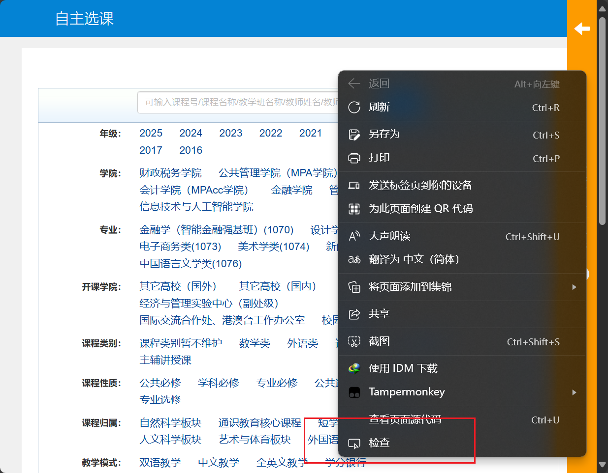
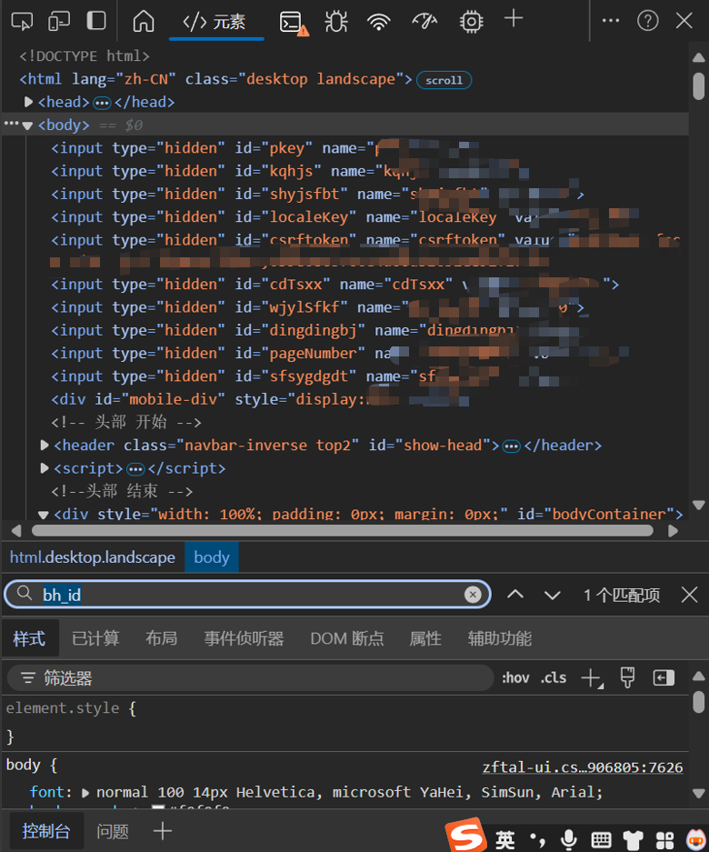
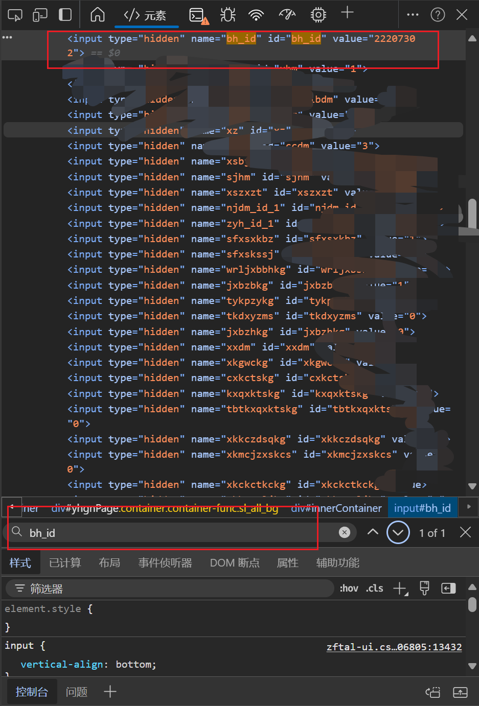

# ZUFE-基于方正教务系统选课脚本

## 简介

该脚本基于方正教务处系统，目前实现的功能为：

- 自动选课
- 获取成绩excel表单

## 环境依赖

- Python 3
- Git

## 安装

```
git clone https://github.com/ljj48096/ZUFE.git
cd ZUFE
pip install -r ./requirements.txt
```

## 配置文件

使用之前需要配置好项目下的 [config.json](./config.json) 文件。

下面是对该配置文件的详细说明。  
注意每个课的选课顺序就是在列表中的排列顺序，建议按想选的优先级排课

**注意:**
本脚本只针对三种类型的课程选课，如果哪个类型不想选的话，在[run.py](./run.py) 中把对应的选课代码注释即可：

- 通识选修课
- 主修课程（在选课时，只需要点击“选课”即可的课程，不包括需要选哪个实验班的课）
- 网络课程  

```json
{
    "username": "学号",
    "password": "密码",
    "zyh_id": "专业号",
    "njdm_id": "2022",  //入学年级代码，如2022
    "bh_id": "22207302",  //班号
    "xqh_id": "下沙校区", 
    "jd_id": "12",  //学院代码
    "courses": {
        "通识选修课": [
            {
                "课程名称": "阳明心学",
                "课程代码": "MAR1084",
                "教学班名称": "(2024-2025-2)-MAR1084-02"
            }
        ],
        "主修课程": [
            {
                "课程名称": "自然语言处理",
                "课程代码": "DAT1286",
                "教学班名称": "(2024-2025-2)-DAT1286-01"
            }
        ],
        "网络课程": [
            {
                "课程名称": "\"金生\"幸福课36讲", 
                "课程代码": "OTH1189",
                "教学班名称": "(2024-2025-2)-OTH1152-01"
            }
        ]
    },
    "from_email": "",
    "from_email_psw": "",
    "to_email": "",
    "delay": 5,
    "retry_times": 1000
}
```

## 特殊键值说明

- `retry_times`：重试抢课次数（如果想挂着选课，可以设置成1，建议不要这么干），默认1000次
- `delay`：抢课延迟时间（单位：秒），默认5秒（最好不要调整）  
  
以下几个键值需要自己登上教务系统去找，下节会说明查找方式

- `zyh_id`：专业号
- `bh_id`：班号代码
- `jd_id`：学院代码
- `教学班名称`：教学班名称

## 查找方式

`zyh_id`、`bh_id`、`bh_id`  

### **STEP 1**：登陆教务系统,并点开**自主选课**或者**推荐课表打印**  

### **STEP 2**：在界面鼠标右键，点击检查  

  

### 此时右边会出现如下界面  

  

### **STEP 3**：按住ctrl+f，在搜索栏搜索对应的键名，例如，在下图中搜索`zyh_id`,会得到匹配项，对应的值就是锁定行中的值，也就是`zyh_id`的值。以此类推，找到其他几个值。  

  

`教学班名称`
在选课的时候，最左边的值

如果没找到的话，也可以不填，但是选课的时候会选择最早的那节课，所以还是建议填上。格式为`(学年跨度-上课学期)-课程代码-教学班号`，例如：`(2024-2025-2)-DAT1286-01`。一般来说结尾是`-01`的就是第一堂课，`-02`的就是第二堂课。

## 快速开始

安装完成，配置完文件就可以愉快的运行了。  

```
python ./run.py  
```

## 致谢

该脚本的大致框架参考了Cyrus97的 [HDU](https://github.com/Cyrus97) ，在此表示感谢。  
在验证码识别部分，使用了ddddocr的API，感谢[sml2h3](https://github.com/sml2h3/ddddocr)的提供。

## 注意

该脚本仅供学习交流使用，请勿用于商业用途，请遵守方正教务系统的使用规范。

## 之后可能会搞得优化

- 简化一些键值对的查找，啥啥啥id不用自己去找
- 完善脚本可选课类型

## 感悟

写这个脚本是源于想找些能直接给浙财学生用的脚本，但是苦于财经类院校确实没啥人写这玩意，于是想着整点东西。  
本来大一进来就想做选课脚本了，但是一拖再拖，已经熬成大三老登了才想起来做。里面很多屎山，自己都不忍直视。希望有更有能力的同学来优化下。
